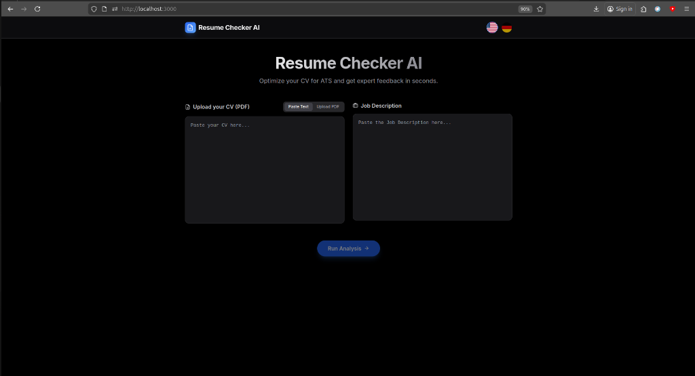

# Resume Checker AI

An intelligent tool designed to help job seekers optimize their resumes. This application analyzes your CV against a specific Job Description (JD) to provide actionable feedback, an ATS compatibility score, and personalized recommendations.

🔗 **Live Demo:** [resume-checker-pi.vercel.app](https://resume-checker-pi.vercel.app)



## 🚀 Features

- **Dual Input Methods**: Paste your CV text directly or upload a PDF file.
- **Job Description Analysis**: Compare your resume against a specific job description to ensure alignment.
- **Detailed Feedback**:
  - **ATS Score**: Get a score representing how well your resume matches the job.
  - **Strengths & Weaknesses**: Identify what you're doing right and where you can improve.
  - **Keyword Analysis**: See which keywords from the JD are missing in your resume.
  - **Tailored Recommendations**: Specific suggestions to close gaps.
- **Multi-language Support**: Currently supports English and German.
- **Modern UI**: Built with a clean, responsive design supporting both Light and Dark modes.

## 🛠️ Tech Stack

- **Framework**: [Next.js 14](https://nextjs.org/) (App Router)
- **Language**: [TypeScript](https://www.typescriptlang.org/)
- **Styling**: [Tailwind CSS](https://tailwindcss.com/)
- **Icons**: [Lucide React](https://lucide.dev/)
- **PDF Processing**: `pdf-parse`
- **AI**: [Google Gemini API](https://ai.google.dev/)

## 🏁 Getting Started

Follow these steps to set up the project locally.

### Prerequisites

- Node.js (v18 or higher recommended)
- npm or yarn
- Google Gemini API key (get one from [Google AI Studio](https://aistudio.google.com/app/apikey))

### Installation

1. Clone the repository:
   ```bash
   git clone <repository-url>
   cd resume-checker
   ```

2. Install dependencies:
   ```bash
   npm install
   ```

3. Create a `.env.local` file in the root directory and add your Gemini API key:
   ```bash
   GEMINI_API_KEY=your_api_key_here
   ```

4. Run the development server:
   ```bash
   npm run dev
   ```

5. Open [http://localhost:3000](http://localhost:3000) with your browser to see the result.

## 📖 Usage

1. **Enter your CV**: Paste your resume text into the left panel or click "Upload PDF" to select a file.
2. **Enter Job Description**: Paste the job description you are applying for into the right panel.
3. **Select Language**: Choose between English (US flag) or German (DE flag) using the toggle in the header.
4. **Analyze**: Click the "Analyze Resume" button.
5. **Review Results**: Scroll down to see your ATS score, missing keywords, and specific advice on how to improve your resume.

## 🤖 AI-Powered Analysis

This application uses **Google Gemini AI** to provide real-time, intelligent analysis of your resume against job descriptions. The AI evaluates:
- ATS compatibility score
- Strengths and weaknesses
- Missing keywords
- Specific recommendations for improvement
- Revised versions of your resume bullets

## 🚀 Deployment

When deploying to Vercel or other platforms, make sure to add the `GEMINI_API_KEY` environment variable in your deployment settings.

## 📂 Project Structure

- `src/app`: Main application code (Next.js App Router).
- `src/components`: Reusable UI components (e.g., AnalysisResult).
- `src/lib`: Utility functions and translations.
- `public`: Static assets.

## 🤝 Contributing

Contributions are welcome! Please feel free to submit a Pull Request.
